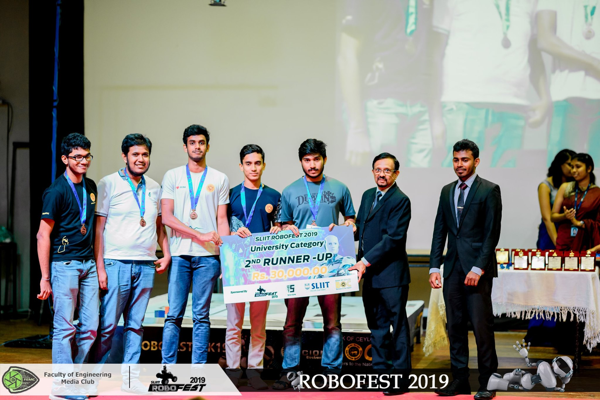
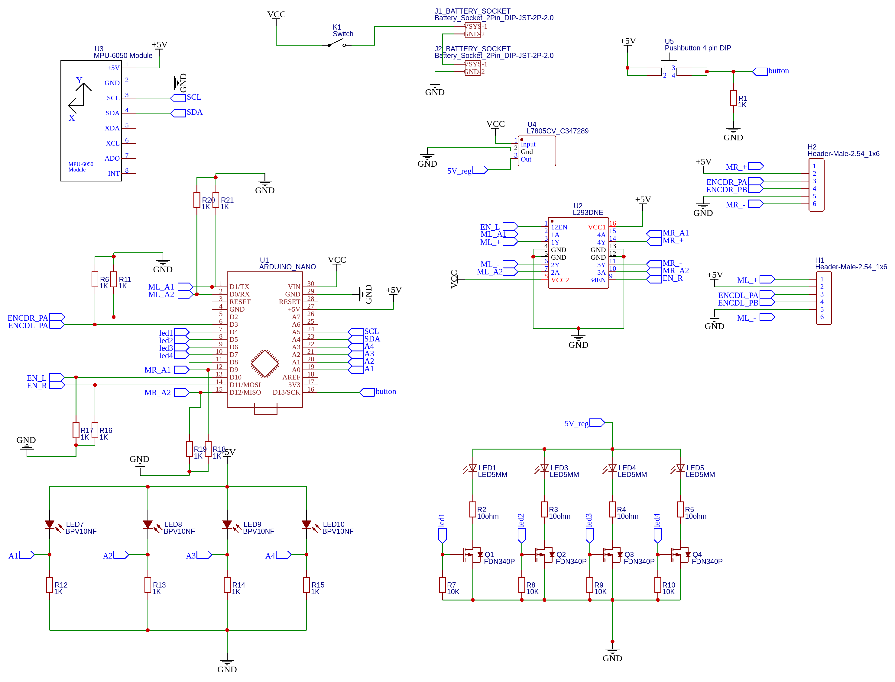

# Micromouse
This micromouse was designed and built to compete at the SLIIT Robofest 2019.

Link to [repo](https://github.com/rahalnanayakkara/micromouse)

Our team was placed 3rd overall (2nd runner up) at the final competition

Other team members were :
1. [Heshan Dissanayake](https://github.com/HeshanDissanayake)
2. [Praveen Dhananjaya](https://github.com/praveendhananjaya)
3. Sanushka Kahatapitiya
4. Praditha Alwis

## Hardware Design and Development

